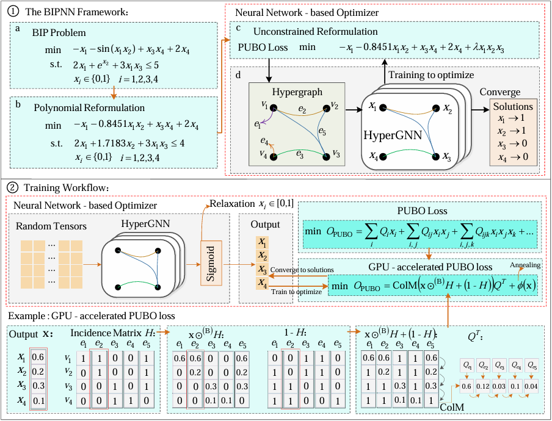
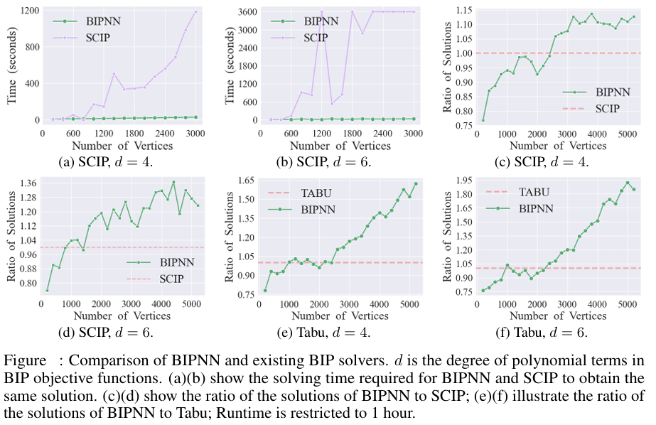
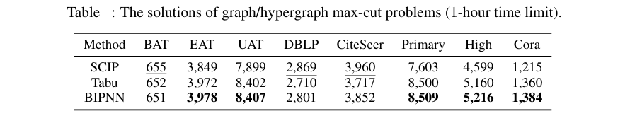
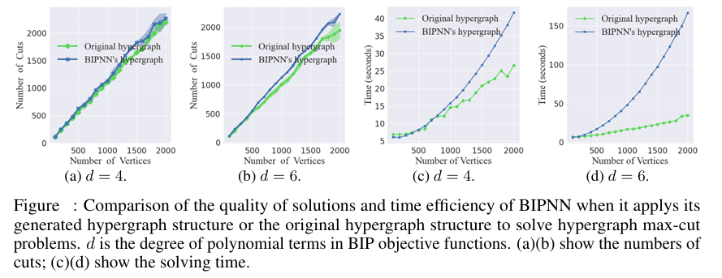
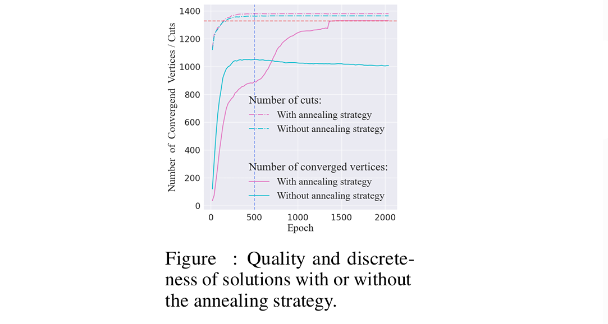

# BIPNN: Learning to Solve Binary Integer Programming via Hypergraph Neural Networks
This repository is the official implementation of *BIPNN: Learning to Solve Binary Integer Programming via Hypergraph Neural Networks*


## Requirements

To install requirements, you need [anaconda](https://www.anaconda.com/) or [miniconda](https://www.anaconda.com/docs/getting-started/miniconda/main) and run:

> conda env create -f environment.yaml  

## Run code

We provide a beautiful notebook file `example/desc.ipynb` that combines code to restate our work in the paper and reproduces some experimental results for your reference, You can either just browse it using jupyter or try to re-run it even if it already contains all the results. 

In addition, we have provided some experiments in the `test/` folder

## Project directory structure

```
📦src
 ┣ 📂maxcut
 ┃ ┣ 📜__init__.py
 ┃ ┣ 📜loss.py
 ┃ ┗ 📜utils.py
 ┣ 📜__init__.py
 ┣ 📜constraints.py
 ┣ 📜core.py
 ┣ 📜loss.py
 ┣ 📜models.py
 ┣ 📜train.py
 ┗ 📜utils.py
 ```

## Results

### The Effectiveness of BIPNN’s Hypergraph Generation Mechanism:


### Comparison with Linearization-based BIP Solvers for Hypergraph maxcut problems:



### Conversion algorithm



### Annealing Strategy
